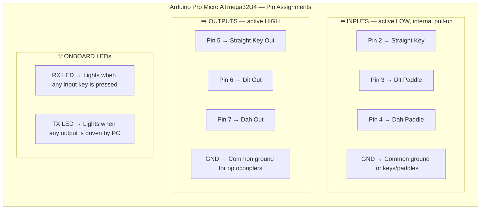
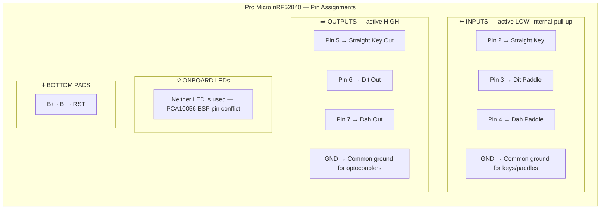
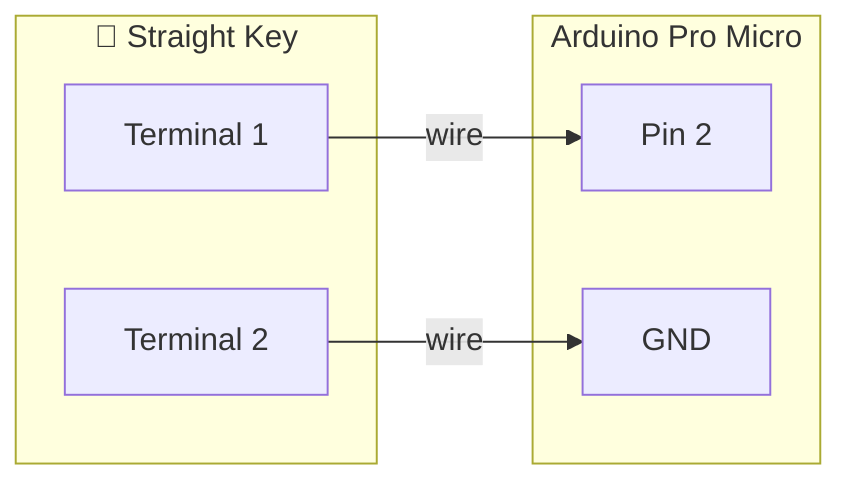
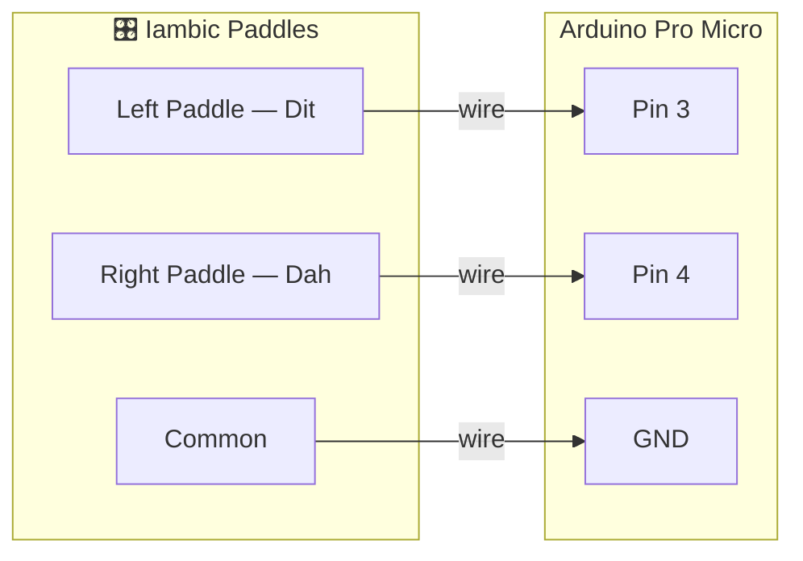
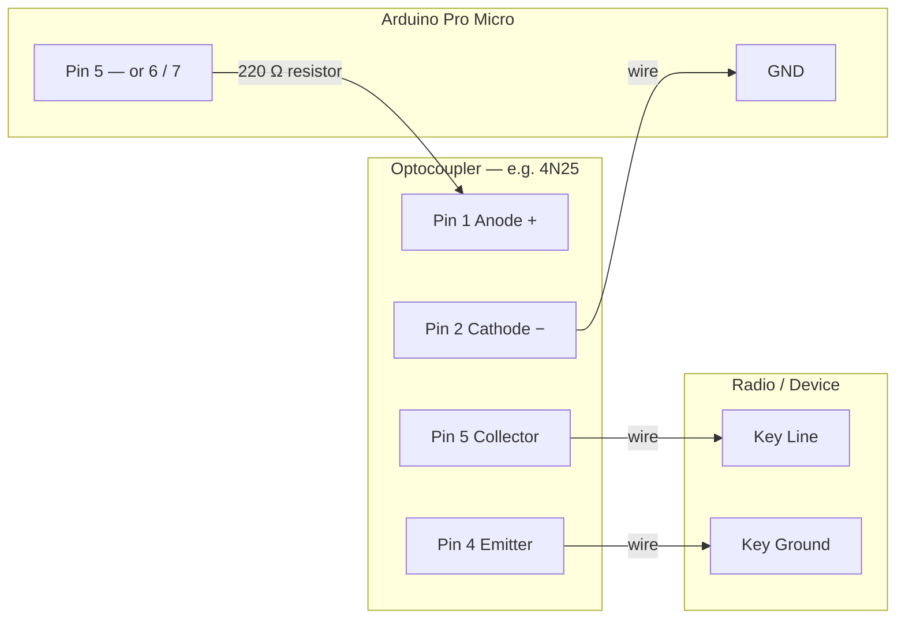

# Arduino Pro Micro MIDI Interface

A USB MIDI hardware interface for [Morse Code Studio](../README.md), built on the **Arduino Pro Micro**. It bridges physical morse keys and paddles with the browser application over standard USB MIDI — no drivers required.

Two sketch variants are provided:

| Folder | Board | Chip | USB Library |
|--------|-------|------|-------------|
| [`Arduino_Pro_Micro_MIDI_Interface/`](Arduino_Pro_Micro_MIDI_Interface/) | Classic Pro Micro | ATmega32U4 | MIDIUSB |
| [`Arduino_Pro_Micro_NRF52840_MIDI_Interface/`](Arduino_Pro_Micro_NRF52840_MIDI_Interface/) | Pro Micro nRF52840 (Supermini, nice!nano, etc.) | nRF52840 | Adafruit TinyUSB + MIDI Library |

Both use the **same pin positions and wiring** — only the software differs.

---

## What it does

| Direction | Function |
|-----------|----------|
| **Input** | A straight key or iambic paddles connected to the Arduino send MIDI Note On/Off messages to Morse Code Studio when contacts close or open. |
| **Output** | Morse Code Studio sends MIDI Note On/Off messages to the Arduino, which drives output pins HIGH/LOW — typically through an optocoupler to key a radio transmitter. |

---

## Pin assignments

Both board variants use the same pins:

| Pin | Function | Direction | Notes |
|-----|----------|-----------|-------|
| 2 | Straight Key | Input | Internal pull-up; short to GND to activate |
| 3 | Dit Paddle | Input | Internal pull-up; short to GND to activate |
| 4 | Dah Paddle | Input | Internal pull-up; short to GND to activate |
| 5 | Straight Key | Output | LOW by default; goes HIGH on MIDI command |
| 6 | Dit | Output | LOW by default; goes HIGH on MIDI command |
| 7 | Dah | Output | LOW by default; goes HIGH on MIDI command |
| GND | Common ground | — | Shared by both inputs and outputs |

### ATmega32U4 Pin Overview

### nRF52840 Pin Overview

The nRF52840 Pro Micro has the same pin layout plus 3 bottom pads (B+, B−, RST for battery). The onboard LEDs are **not used** by this sketch — the PCA10056 board definition maps LED constants to different GPIO pins than those on the Supermini/nice!nano, causing conflicts.

---

## MIDI defaults

| Parameter | Value |
|-----------|-------|
| Channel | 1 (shown as 0 in some software) |
| Velocity | 127 |
| **Input** notes (Arduino → PC): | |
| Straight Key | 60 (C4) |
| Dit | 62 (D4) |
| Dah | 64 (E4) |
| **Output** notes (PC → Arduino): | |
| Straight Key | 66 (F#4) |
| Dit | 68 (G#4) |
| Dah | 70 (A#4) |

Input and output notes are deliberately different to prevent feedback loops when both MIDI input and MIDI output are enabled on the same device.

All values are configurable at the top of each sketch before uploading.

---

## Wiring diagrams

### Straight Key Input

Connect a straight key (or any normally-open switch) between **Pin 2** and **GND**. No external resistors are needed — the Arduino's internal pull-up keeps the pin HIGH when the key is open.

### Iambic Paddle Input

Connect an iambic paddle's **dit** contact to **Pin 3**, **dah** contact to **Pin 4**, and **common** to **GND**.

### Output via Optocoupler

To key a radio transmitter, connect an output pin through a **220 Ω resistor** to the anode of an optocoupler (e.g. 4N25). The optocoupler's output side connects to the radio's key line, providing electrical isolation.

This diagram shows one channel — repeat for each output pin you need (Pin 5, 6, or 7).

---

## Requirements

### ATmega32U4 variant

- **Board:** Arduino Pro Micro 5V/16MHz (or any ATmega32U4 board with native USB)
- **Library:** [MIDIUSB](https://github.com/arduino-libraries/MIDIUSB) by Gary Grewal
- **Arduino IDE:** Tools → Board → "Arduino Micro"

### nRF52840 variant

- **Board:** Pro Micro nRF52840, Supermini nRF52840, nice!nano, or similar
- **Board package:** [Adafruit nRF52](https://github.com/adafruit/Adafruit_nRF52_Arduino) — add the Adafruit board URL in Preferences, then install via Boards Manager
- **Libraries:**
  - [Adafruit TinyUSB Library](https://github.com/adafruit/Adafruit_TinyUSB_Arduino)
  - [MIDI Library](https://github.com/FortySevenEffects/arduino_midi_library) by Forty Seven Effects
- **Arduino IDE:** Tools → Board → Adafruit nRF52 Boards → **"Nordic Semiconductor nRF52840 DK (PCA10056)"**; Tools → USB Stack → "TinyUSB"
- **Important:** Do NOT select "Adafruit Feather" or "ItsyBitsy" — they remap pin numbers and cause hard faults on clone boards. The Nordic DK definition uses raw GPIO numbers, which the sketch is configured for.

---

## Quick start

1. Open the appropriate sketch folder in the Arduino IDE:
   - **ATmega32U4:** `Arduino_Pro_Micro_MIDI_Interface/`
   - **nRF52840:** `Arduino_Pro_Micro_NRF52840_MIDI_Interface/`
2. Install the required libraries (see above).
3. Select your board and port under **Tools**.
4. Review the pin and MIDI configuration constants at the top of the sketch — change them if needed.
5. Upload the sketch.
6. Wire your key/paddles to the input pins (see diagrams above).
7. In Morse Code Studio, enable **MIDI Input** and/or **MIDI Output** in Settings and select the Arduino device.

---

## Mermaid diagram source files

The diagrams above are also available as standalone Mermaid files in [`diagrams/`](diagrams/) for editing or conversion to SVG:

| File | Description |
|------|-------------|
| [`pin-overview.mmd`](diagrams/pin-overview.mmd) | ATmega32U4 pin assignments |
| [`pin-overview-nrf52840.mmd`](diagrams/pin-overview-nrf52840.mmd) | nRF52840 pin assignments |
| [`input-straight-key.mmd`](diagrams/input-straight-key.mmd) | Straight key wiring |
| [`input-paddles.mmd`](diagrams/input-paddles.mmd) | Iambic paddle wiring |
| [`output-optocoupler.mmd`](diagrams/output-optocoupler.mmd) | Optocoupler output wiring |

---

## License

GNU General Public License v3.0 — see [LICENSE](../LICENSE) for details.
